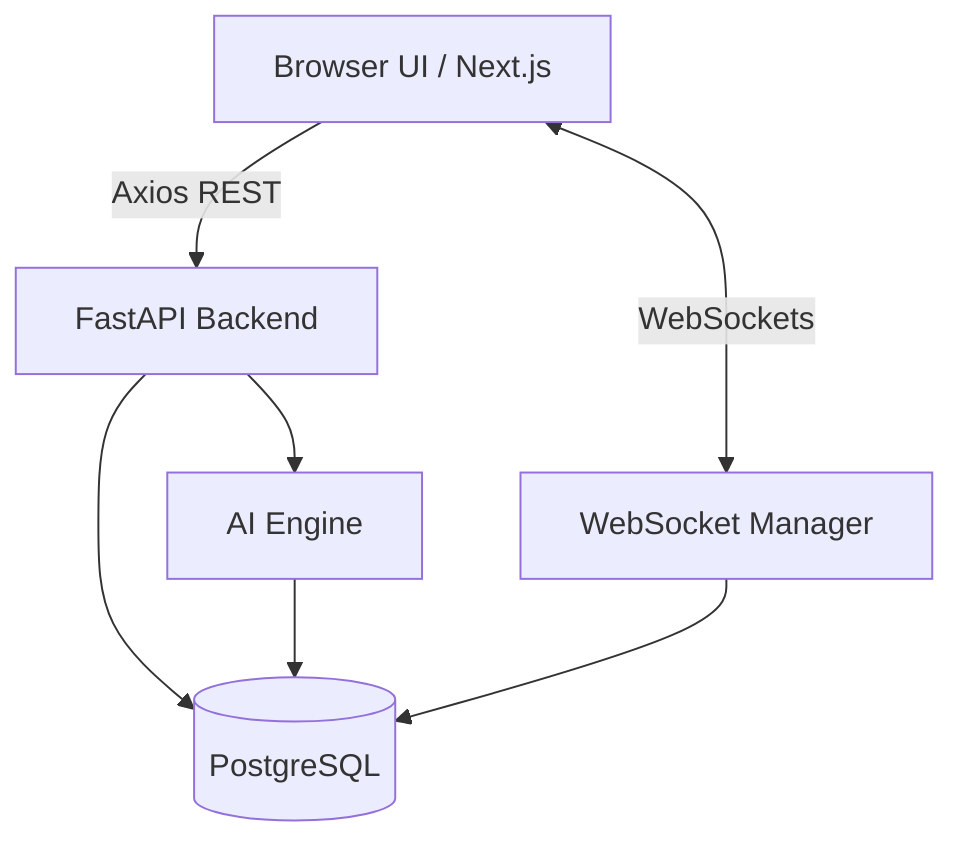
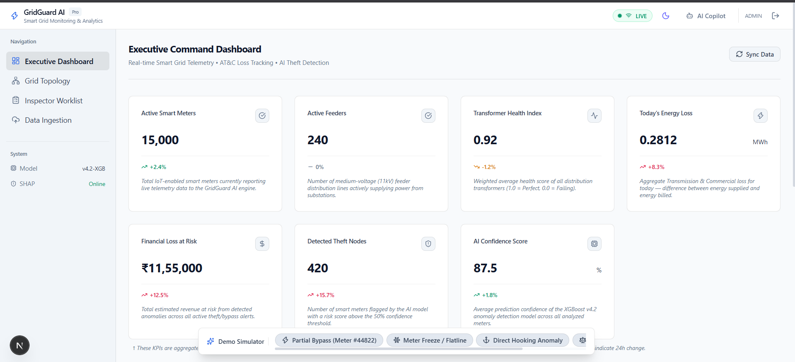
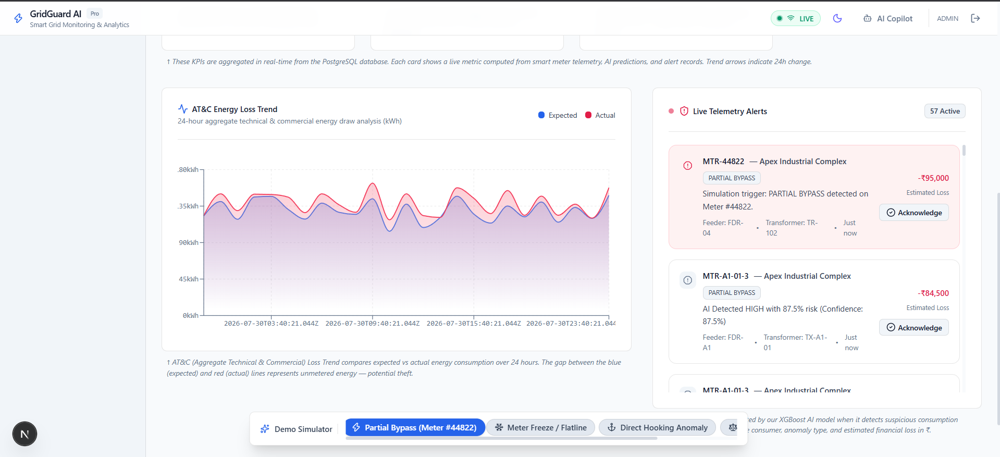
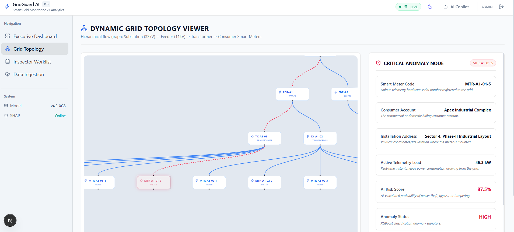
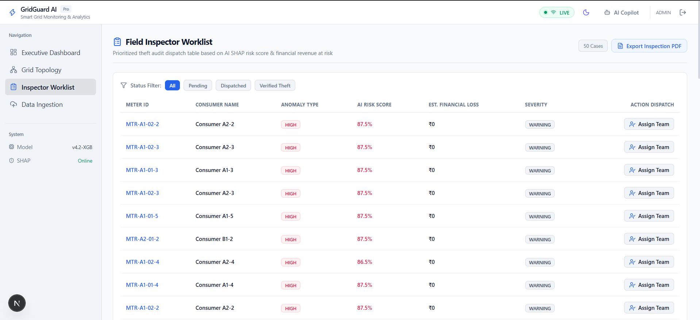
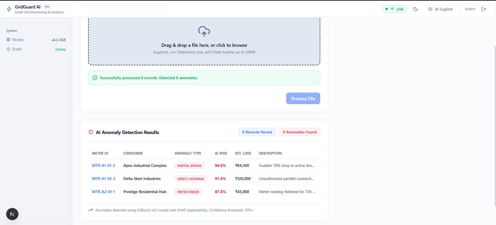

<div align="center">
  <h1>GridGuard AI</h1>
  <p>Intelligent Telemetry, Anomalous Threat Detection, and Live Power Grid Monitoring.</p>
</div>

---

## Overview

GridGuard AI is a proactive smart grid telemetry dashboard designed to identify power theft and unmetered energy loss (AT&C losses) in real time. By ingesting live smart meter data via WebSockets and processing it through an anomaly detection pipeline, GridGuard provides utility dispatchers with an interactive command center to visually trace and quantify electrical theft.

## Architecture

The system utilizes a decoupled, asynchronous architecture. 

- **Frontend:** Next.js 14, React, Tailwind CSS, Zustand, React Flow, Recharts
- **Backend:** Python, FastAPI, SQLAlchemy 2.0 (Async), PostgreSQL
- **Data Transport:** WebSockets for real-time telemetry, REST for stateful mutations
- **AI Integration:** Simulated XGBoost inference engine with SHAP value generation for explainability



## Core Features

**Live Telemetry Stream**
Sub-second anomaly detection streamed directly to the browser. The architecture decouples the WebSocket stream from the React rendering cycle using a ring-buffer state manager to ensure the UI does not freeze during high-throughput events.

**Dynamic Grid Topology**
A visual, hierarchical mapping of the grid from Substation down to the Smart Meter. Built on React Flow, this allows operators to trace anomalies to their exact physical origin.

**Financial Context and Explainable AI**
Detected anomalies are instantly quantified into localized financial loss. SHAP value summaries are generated to explain the AI's reasoning (e.g., Phase Voltage Mismatch, Peak Hour Drop), moving away from black-box AI toward actionable insights.

**Automated Data Ingestion**
A pipeline designed to digitize legacy workflows. Utility operators can upload legacy PDF field audits or batch CSV telemetry, which the backend parses, extracts anomalies from, and injects directly into the database.

## Interfaces

### Executive Command Dashboard
The primary landing view for utility administrators. It aggregates KPIs directly from the PostgreSQL database, providing a live snapshot of active smart meters, grid health, and total estimated financial loss across all active theft alerts. The dashboard is fully responsive and recalculates metrics in real time.


### Live Telemetry and AT&C Analysis
A dynamic 24-hour analysis comparing expected energy draw versus actual consumption. This view is paired with an asynchronous WebSocket alert feed that pushes critical AI classifications directly to the dispatcher, bypassing the need for manual page refreshes.


### Dynamic Grid Topology Viewer
A highly interactive, hierarchical mapping of the electrical distribution network. Built using React Flow, it allows dispatchers to physically trace anomalies from the main Substation down to the exact Smart Meter. Selecting a flagged node reveals AI confidence scores and anomaly severity.


### Field Inspector Worklist
A targeted dispatch table designed to replace blind field audits. By sorting AI-detected anomalies by risk score and severity, field inspectors are deployed only where theft is highly probable, drastically reducing operational costs and maximizing revenue recovery.


### Automated Data Ingestion
A legacy system bridge that digitizes historical offline records. Utility operators can drag and drop PDF field audits or batch CSV telemetry files. The backend immediately parses these documents, extracts threat intelligence, and synchronizes the findings into the central database.


## Installation and Execution

Ensure Node.js (v18+), Python (v3.10+), and PostgreSQL are installed.

### 1. Database Initialization
Create a PostgreSQL database named `gridguard`. Ensure the service is running on port `5432` with standard credentials (or update the backend environment variables).

### 2. Backend Service
The backend will automatically generate the database schema and seed mock data on initial startup.

```bash
cd backend
python -m venv .venv
# Activate the virtual environment
# Windows: .\.venv\Scripts\activate
# Unix: source .venv/bin/activate

pip install -r requirements.txt
python -m uvicorn app.main:app --host 0.0.0.0 --port 8000
```

### 3. Frontend Application
Open a separate terminal instance for the client.

```bash
cd frontend
npm install
npm run dev
```

Navigate to `http://localhost:3000` to view the application.

## Future Development Scope

- **Message Broker Integration:** Implement Apache Kafka to buffer high-concurrency MQTT telemetry streams prior to FastAPI ingestion.
- **Time-Series Storage:** Migrate the historical telemetry tables from standard PostgreSQL to TimescaleDB for optimized temporal queries.
- **Model Deployment:** Connect the prediction endpoints to pre-trained `.pkl` Scikit-Learn or XGBoost models to replace the deterministic mock engine.