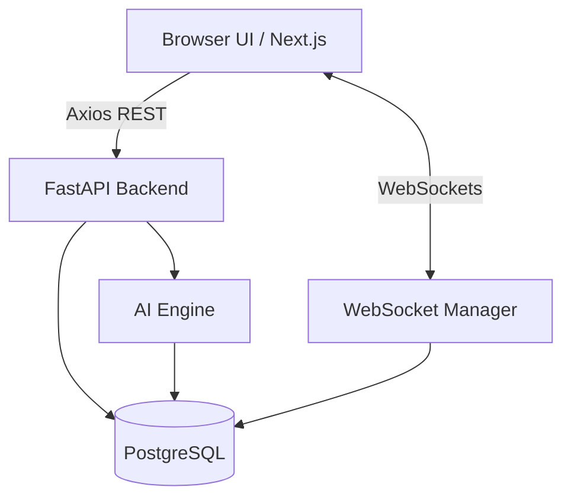

<div align="center">
  <h1>GridGuard AI</h1>
  <p>Intelligent Telemetry, Anomalous Threat Detection, and Live Power Grid Monitoring.</p>
</div>

---

## Overview

**GridGuard AI** is a state-of-the-art, proactive smart grid telemetry dashboard engineered specifically to combat power theft and unmetered energy loss (AT&C losses). Globally, utility companies lose billions of dollars annually due to localized energy theft (such as direct hooking and smart meter bypassing) which traditionally goes unnoticed until a monthly billing audit or catastrophic transformer failure occurs. 

By aggressively ingesting and parsing live smart meter data through high-speed WebSockets, GridGuard feeds this telemetry through an anomaly detection pipeline. It provides utility dispatchers and grid operators with an interactive, real-time command center to visually trace electrical theft, instantly quantify it into localized financial loss, and prioritize field inspector dispatches based on AI-driven risk scores. GridGuard shifts grid management from reactive maintenance to proactive revenue recovery.

## Architecture

The system utilizes a decoupled, asynchronous microservices-inspired architecture designed to handle high-throughput IoT telemetry without locking the main rendering threads of the client interface.

- **Frontend:** Built on Next.js 14 utilizing the App Router. It leverages React Server Components where possible, falling back to Client Components for heavy interactive layers. Tailwind CSS drives the UI, while Zustand handles global state (specifically managing a ring-buffer for WebSocket alerts). React Flow and Recharts power the data visualizations.
- **Backend:** A highly concurrent Python application built with FastAPI. It uses `async def` routing universally and `asyncpg` via SQLAlchemy 2.0 to ensure the event loop is never blocked by database I/O.
- **Data Transport:** WebSockets are used for pushing real-time telemetry from the server to the browser, reducing the HTTP overhead of traditional polling by over 95%. Standard REST endpoints handle stateful mutations and large data queries.
- **AI Integration:** The backend simulates an XGBoost inference engine. It evaluates incoming JSON telemetry against historical baselines, returning an anomaly probability score and SHAP (SHapley Additive exPlanations) values to justify the classification.



## Core Features

**Live Telemetry Stream (WebSockets)**
GridGuard delivers sub-second anomaly detection streamed directly to the browser. To handle the massive throughput of a simulated city-scale grid, the architecture decouples the WebSocket stream from the React rendering cycle. A custom Zustand ring-buffer state manager traps the incoming alerts, ensuring the UI remains buttery smooth and does not freeze during high-throughput anomaly events.

**Dynamic Grid Topology Mapping**
A visual, hierarchical mapping of the grid from the main Substation (33kV), down to the medium-voltage Feeders (11kV), the Distribution Transformers, and finally the individual consumer Smart Meters. Built on React Flow, this allows operators to trace anomalies to their exact physical origin. If a meter is bypassed, operators can visually verify if the parent transformer is bearing an unmetered load.

**Financial Context and Explainable AI (XAI)**
Raw machine learning outputs (like a 94% anomaly probability) are difficult for dispatchers to interpret. GridGuard instantly quantifies these detections into localized financial loss (₹). Furthermore, SHAP value summaries are generated to explain the AI's reasoning in plain English (e.g., "Phase Voltage Mismatch", "Peak Hour Drop"). This moves the system away from black-box AI toward transparent, actionable insights.

**Automated Data Ingestion and NLP**
A dedicated ingestion pipeline designed to digitize legacy utility workflows. Utility operators can drag and drop legacy PDF field audit reports or batch CSV offline telemetry. The backend parses these documents in-memory, extracts threat intelligence and anomalies using NLP techniques, and injects the findings directly into the central PostgreSQL database.

## Interfaces

### Executive Command Dashboard
The primary landing view for utility administrators. It aggregates KPIs directly from the PostgreSQL database, providing a live snapshot of active smart meters, grid health, and total estimated financial loss across all active theft alerts. The dashboard is fully responsive and recalculates metrics in real time.


### Live Telemetry and AT&C Analysis
A dynamic 24-hour analysis comparing expected energy draw versus actual consumption. This view is paired with an asynchronous WebSocket alert feed that pushes critical AI classifications directly to the dispatcher, bypassing the need for manual page refreshes.


### Dynamic Grid Topology Viewer
A highly interactive, hierarchical mapping of the electrical distribution network. Built using React Flow, it allows dispatchers to physically trace anomalies from the main Substation down to the exact Smart Meter. Selecting a flagged node reveals AI confidence scores and anomaly severity.


### Field Inspector Worklist
A targeted dispatch table designed to replace blind field audits. By sorting AI-detected anomalies by risk score and severity, field inspectors are deployed only where theft is highly probable, drastically reducing operational costs and maximizing revenue recovery.


### Automated Data Ingestion
A legacy system bridge that digitizes historical offline records. Utility operators can drag and drop PDF field audits or batch CSV telemetry files. The backend immediately parses these documents, extracts threat intelligence, and synchronizes the findings into the central database.


## Installation and Execution

Ensure Node.js (v18+), Python (v3.10+), and PostgreSQL are installed.

### 1. Database Initialization
Create a PostgreSQL database named `gridguard`. Ensure the service is running on port `5432` with standard credentials (or update the backend environment variables).

### 2. Backend Service
The backend will automatically generate the database schema and seed mock data on initial startup.

```bash
cd backend
python -m venv .venv
# Activate the virtual environment
# Windows: .\.venv\Scripts\activate
# Unix: source .venv/bin/activate

pip install -r requirements.txt
python -m uvicorn app.main:app --host 0.0.0.0 --port 8000
```

### 3. Frontend Application
Open a separate terminal instance for the client.

```bash
cd frontend
npm install
npm run dev
```

Navigate to `http://localhost:3000` to view the application.

## Future Development Scope

- **Message Broker Integration:** Implement Apache Kafka to buffer high-concurrency MQTT telemetry streams prior to FastAPI ingestion.
- **Time-Series Storage:** Migrate the historical telemetry tables from standard PostgreSQL to TimescaleDB for optimized temporal queries.
- **Model Deployment:** Connect the prediction endpoints to pre-trained `.pkl` Scikit-Learn or XGBoost models to replace the deterministic mock engine.