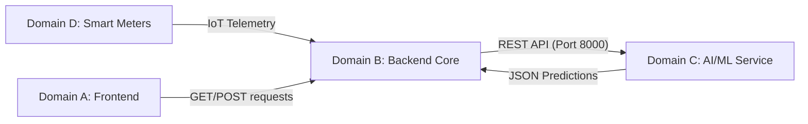

# GridGuard AI - Domain C Integration Architecture

This document outlines how Domain C (AI/ML Inference Service) connects to the rest of the GridGuard ecosystem (Domain A: Frontend, Domain B: Backend, Domain D: Integrations/IoT).

## 1. High-Level Architecture Flow



### The "Air Gap" Principle
Domain C is entirely isolated from the rest of the application. 
- **No Database Access**: The AI never reads from or writes to PostgreSQL, MongoDB, or Redis.
- **No Authentication**: The AI has no concept of users or JWTs.
- **No Frontend Coupling**: The frontend does not call the AI directly.

Domain C simply exists as a stateless, highly optimized computational engine. 

## 2. Integration with Domain B (Backend Core)

The Backend acts as the orchestrator. When the Backend needs to assess the risk of a smart meter (e.g., during a scheduled health check or when new telemetry arrives), it sends an HTTP POST request to the AI Service.

### Endpoint: `POST /predict/risk` (Anomaly/Theft Detection)
**Backend Sends:**
```json
{
    "gridId": "IND-001",
    "currentLoad": 15.0,
    "temperature": 34.1,
    "humidity": 62.0,
    "timestamp": "2026-07-30T12:00:00Z"
}
```

**AI Responds:**
```json
{
    "prediction": 0.85,
    "confidence": 0.92,
    "riskLevel": "HIGH",
    "modelVersion": "v1.0.0",
    "explanation": ["Current load of 15.00 increases the risk score."]
}
```
The Backend receives this JSON and saves it into its own database (e.g., triggering an alert if `riskLevel == HIGH`).

## 3. Integration with Domain A (Frontend)

The Frontend (Next.js/React) is responsible for visualizing the AI's insights to the Grid Operator.
1. The Frontend queries the Backend for meter status: `GET /api/meters/IND-001`
2. The Backend returns the stored data, including the `confidence` score and `explanation` string previously generated by Domain C.
3. The Frontend displays this data in a UI component (e.g., a red warning badge showing "92% Confidence of Theft" and a tooltip showing the AI's explanation).

## 4. Integration with Domain D (IoT / Smart Meters)

Domain C never talks to the physical IoT devices. However, the data pipeline in Domain C depends entirely on the schema defined by Domain D.
- Domain D deploys physical/simulated smart meters that emit MQTT messages containing `currentLoad`, `temperature`, and `humidity`.
- Domain B ingests these MQTT messages.
- Domain B forwards those exact metrics to Domain C for scoring.
- Therefore, the AI models are trained explicitly to understand the telemetry signatures produced by Domain D's hardware.
